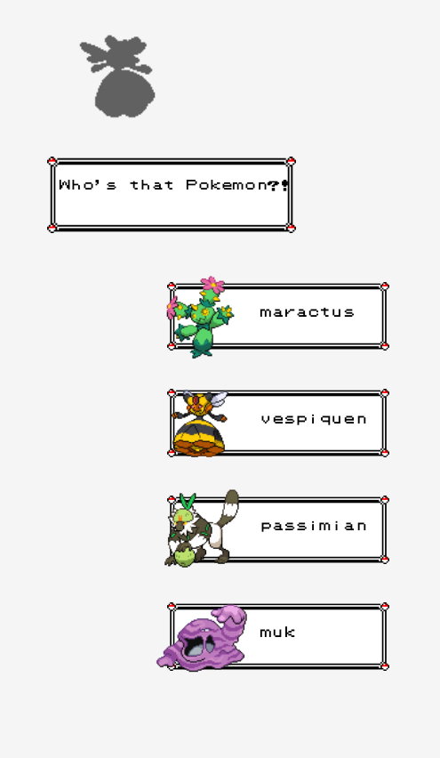
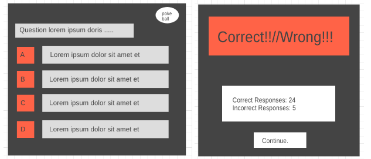

# project1-SEI-119

API project
This was an assigned project for my cohort due on Feb 5,2021. It was an exercise in leveraging an API on a single-page site to practice DOM manipulation. 
I decided to have a little fun with the PokeAPI to create a quizzing game that would fetch data from the API and client-side logic would create quiz questions 
based on the pokemon data retrieved. There were many question types originally conceived:

"What's this pokemon's weakness?"
"Which attack would be 'super-effective' against this pokemon?"
"Who's that pokemon?"
"Which pokemon does this pokemon evolve into at level [#here]?
"what type is this pokemon?"
Technologies used: Javasript, HTML, CSS, PokeAPI, Git, Github, Github pages

Installation instructions: N/A

I was motivated by the user story:
"I expect immediate feedback on correct answer and that it is verifiably the correct answer."

Here are some original wireframes:

             
Ultimately being given only a week to work on the project for one week, I had a robust working version for only type of question: 
"Who's that pokemon?" with a provided option to select difficulty. I had vastly overestimated what I could accomplish in a week. 
Regardless, going in I picked one types of question to get running before moving on to other types. 
It was after completing the first question type that I realized I would only have that question type if I was going to meet the deadline. 
In the future, I would like to provide all the question types I had originally concieved.

This project was a milestone first. I've never written a recursive function that wasn't trivial. Here in my pokemon randomizer method was a recursive definition. Although, it may be argued it's not truly recursive because it checks against an out of scope variable, it was recursive enough for me to feel like I earned that badge. A recursive defition decomplicated what would have been a complicated mess of nested if statements.

Major hurdles
There was quite a bit to learn about fetch().then(...).then() chains. THe asynchronous nature of fetch calls required drastic revision of my original approach to the problem. I solved some issues through the use of what I called, "empty invoations" of methods and functions. My fetch calls were nested in for() loops so instead of isssuing readability problems with nested if statements in my .then statements, I called the methods every iteration but the code inside would only run if said if conditions were matched. By placing the if condition inside the method, the methods would be called to run nothing if the fetch requests weren't done. Not an elegan solution. I learned later that javascript has built-in tools for dealing with multiple fetch requests. 

CSS took three times as long as any Javascript logic. Not because the styling is an impressive magnum opus, the truth is much less glorious. CSS , prior to this project, has been a major deficiency that needed attention. I learned a lot. 

Outstanding problems:
A reset button. It was glaring quality of life feature to miss, but there it is. I missed such an obvious feature. In the future, I would like to fix this glaring mistake. 